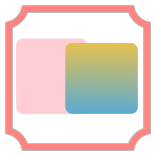

  

<h1 align="center">Improve-ImgSLI Website</h1>

  The official landing page for the <strong>Improve-ImgSLI</strong> application, a modern and responsive website built to showcase its features, releases, and development journey.

  
  
  

---

## 📸 Screenshot

  

---

## 📖 Table of Contents

- [About The Project](#about-the-project)
- [Key Features](#key-features)
- [Tech Stack](#tech-stack)
- [Live Demo](#live-demo)
- [Development Story](#development-story)
- [Contributing](#contributing)
- [License](#license)

---

## 🧩 About The Project 

This repository contains the source code for the official landing page of **Improve-ImgSLI**, an advanced open-source image comparison tool.

The website is a static, single-page application designed to be fast, responsive, and easy to navigate. It provides all essential information for users and potential contributors, including feature descriptions, installation guides, release history, and the project's development roadmap.

---

## 🚀 Key Features 

-   **🎨 Modern & Responsive Design**: A clean, dark-themed UI that looks great on both desktop and mobile devices.
-   **🌍 Multi-Language Support**: Built-in internationalization (i18n) with seamless language switching between English, Russian, and Chinese.
-   **🚀 Interactive Elements**: Features like a smooth-scrolling navigation, copy-to-clipboard buttons for code blocks, and an elegant image lightbox gallery with dynamic, multilingual captions enhance the user experience.
-   **📄 Rich Content Sections**: Clearly organized sections for the app's features, releases, development story, and future roadmap.
-   **⚡ Zero Dependencies**: Built with pure HTML, CSS, and Vanilla JavaScript for maximum performance and simplicity.

---

## 🛠️ Tech Stack 

This website was built with fundamental web technologies, without any external frameworks.

-   **HTML5**
-   **CSS3**
-   **Vanilla JavaScript**

---

## 🌠Live Demo 

A live version of the website is hosted on GitHub Pages.

**[➡️ Click here to view the Live Demo](https://improve-imgsli.ru/)**

---

## 🧠 Development Story 

Show Development Story

This website was brought to life in a total of **10 hours**, split into an initial rapid development sprint and a final polishing phase, showcasing the power of modern AI-assisted workflows.

-   **Phase 1: Initial 6-Hour Sprint**
    -   **Conceptualization & Styling (Claude):** The initial design direction, layout ideas, and overall aesthetic were sketched out with the help of Claude. Its ability to generate creative and coherent styling concepts provided the foundational look and feel for the project.
    -   **Intensive Development (Gemini & Cursor):** The bulk of the coding—including the HTML structure, final CSS implementation, and all JavaScript logic—was hammered out in a highly productive session using a combination of Google's Gemini and Cursor. This AI pairing was instrumental in refining the initial concepts and writing clean code for interactive features like the i18n switcher and initial lightbox.

-   **Phase 2: Polishing & Deployment (4 hours)**
    -   Following the initial build, this stage involved deploying the site to GitHub Pages, tackling hosting-specific issues, and conducting a thorough UX/UI polish. Key improvements included adding dynamic, multilingual captions to the image lightbox, ensuring a consistent layout across all pages, and consolidating project assets for streamlined maintenance and self-contained deployment.

The entire process, from concept to a fully functional and deployed multi-language site in just 10 hours, serves as a testament to the efficiency of AI-augmented development.

---

## 🤠Contributing 

Contributions are what make the open-source community such an amazing place to learn, inspire, and create. Any contributions you make are **greatly appreciated**.

If you have a suggestion that would make this better, please fork the repo and create a pull request. You can also simply open an issue with the tag "enhancement".

1.  Fork the Project
2.  Create your Feature Branch (`git checkout -b feature/AmazingFeature`)
3.  Commit your Changes (`git commit -m 'Add some AmazingFeature'`)
4.  Push to the Branch (`git push origin feature/AmazingFeature`)
5.  Open a Pull Request

---

## 📄 License 

Distributed under the MIT License. See the `LICENSE.txt` file for more information.
